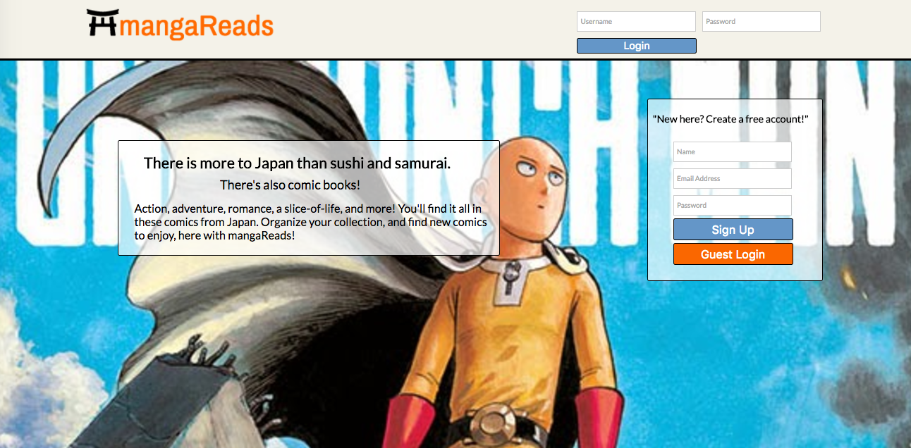
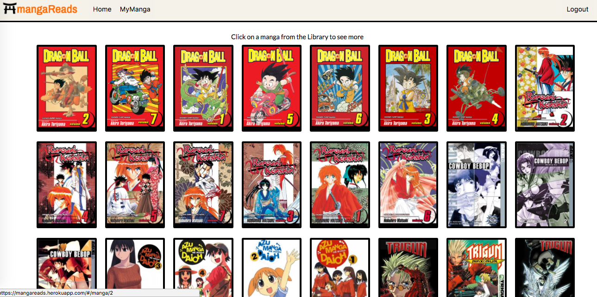
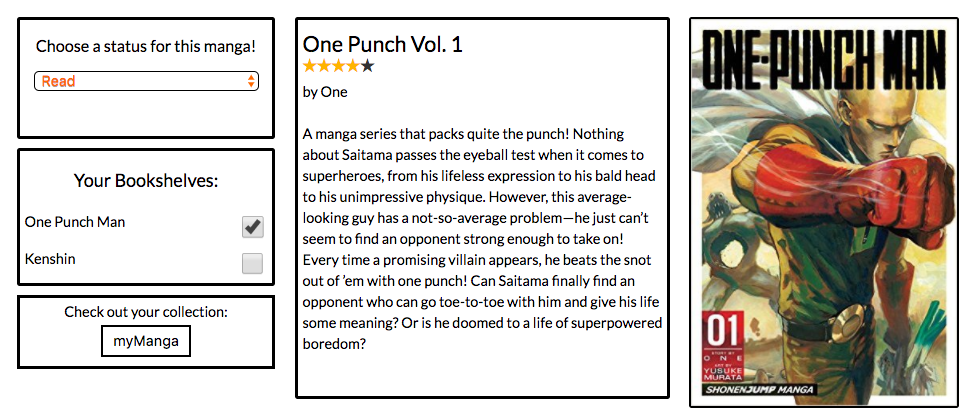

mangaReads
---------------------------------
mangaReads is a full-stack project based on the website GoodReads.

mangaReads is a organization tool designed to allow users to keep track of what
Japanese comics they are currently reading, check other titles that might be of interest
to them, and see/leave reviews.

Users may select a 'status' for a comic, ranging from 'Read', 'Currently-Reading',
or 'Wants-To-Read'. They may also create their own 'bookshelves', allowing them
to organize their collection in the fashion of their own choosing. Finally, they
can also leave/read reviews of different manga.

This project was created using React, Redux, JavaScript, HTML, Rails, and PostgreSQL.

-----------------------------------

One of the initial goals of this website is to have users to create their
own account, thus allowing them to personalize their comic organization.

Users can create their own account if they wish, but I did leave a guest user
login for those that just wish to see what the site is generally like.

After logging in, the user is sent to the home page. This is a collection of
all comics in the database. Each picture is an  tag that is contained inside
of a anchor tag (<a href=) links to that individual comics page.

The comics are organized in rows using flex-wrap which nice wraps the comics into
rows and moves them to the next line down when reaching the end of the page.

At the top of every page is the Topbar. This appears at the top of every page that
the user goes to, but does not follow them down the page.

After clicking on an individual manga, the user is taken the the manga-show
page.

On the left hand side is the 'Status' dropdown. This allows a user to select from
three categories: 'Read', 'Currently-Reading', and 'Want-To-Read'. This feature
is intended to help users remember comics they are interested in. And the status
can be checked on the my-Manga page, linked to on both the bottom and on
the Topbar.

Next we have the 'user bookshelves'. A key part of this site is allowing a user
to organize their collection in any way that they wish. When a shelf is created,
it will show up here. When clicked, an action is dispatched to the database,
creating/deleting the comic from that particular shelf.

Features and Implementation

Manga (Japanese for comics) are stored on the database in a table, with columns for title, author, a synopsis, and an image url. When a user logs in, they are directed to Home Page which displays a collection of comics to purview. At the top of the page is a 'Topbar' component. This component is always available to the user, and is nested inside the App component which wraps all others. Thus the Topbar is available to users at all times.

Upon clicking a comic that piques the users interest, they are directed then to a separate page that displays the manga's data.
The entire page is rendered using only one component, which displays the manga's title, author, synopsis, and a picture of the cover. When the user switches to the manga's individual show page, three API calls are dispatched. The first to get the information for the particular comic, another for the user's bookshelves, and finally, another to compare the 'status' of the page.

The 'status' feature is particularly interesting as it brings together the user's table, the 'manga status' table, the bookshelves table, and the 'manga bookshelves' table. The latter of which is a joins table, we can change the 'status' of particular manga. A manga's status can be one of three things: 'Read', 'Wants-To-Read', or 'Currently-Reading'.

When the user clicks on a dropdown menu, a dispatch is made which in turn dispatches an API call. This will hit a custom route that was created to 'create and destroy' objects on the 'manga bookshelf' table. So if they click once, then a manga is metaphorically placed on/ or removed from these special shelves.

This involves makes several complicated joins which took me some times to get correct. I realized on making this in the model that I in fact needed a little more information to make the proper requests. And thus I learned about pluck, which allows us to get the actual value from a query!

This page also brings together a few other elements to make it a little more interesting. We also bring together a 'bookshelves' table, a 'manga_statuses' table, and the user's table. By using the current user's id, we find their specific bookshelves that they have made as the 'status' of the manga. The status represents whether the user 'Wants to Read', is 'Currently-Reading', or has 'Read' the particular comic. The user may change this status with a click. At the bottom of the page. At the bottom of the page are the user's bookshelves, ordered in a checkbox fashion, allowing them to add to however many shelves they wish.

We can also add our own custom libraries. Using a checkbox feature, a comic can be added to any shelf at will. When the shelf is checked, a dispatch is sent which in the end will place an object, representing the manga on the shelf. This click will fill in/ clear the bubble, letting the user know if there is such an object on that particular shelf.

If we go to the my-Manga page, we will see all of our manga on all pages. This is automatically loaded when the pages is requested. By clicking on the various statuses on the left, we can get all of the appropriate manga for them.

Getting the correct manga is done by using a special filter in the manga model which grabs manga
based on the status and the current user.

We can also create and destroy our own bookshelves on this page. After they are created, clicking
on that shelf will bring up all manga to be found on that shelf. This is done using a simple query
where the current user's id and the shelf's id are matched.
