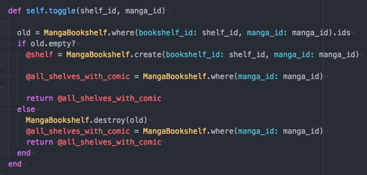
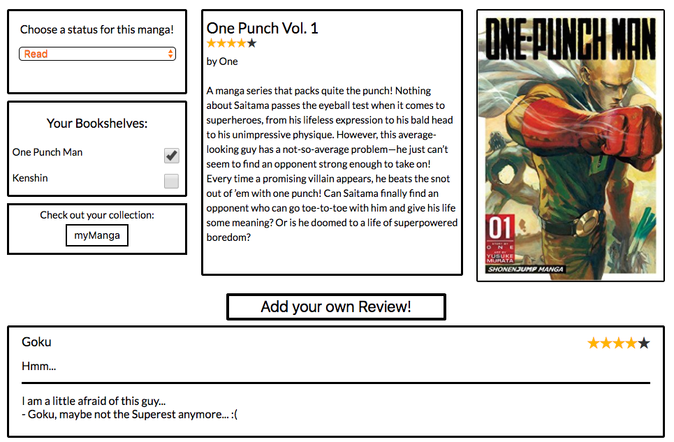
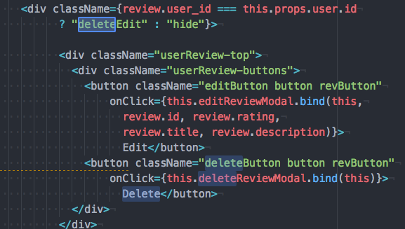
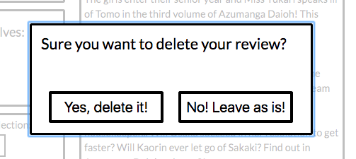
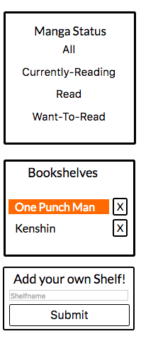
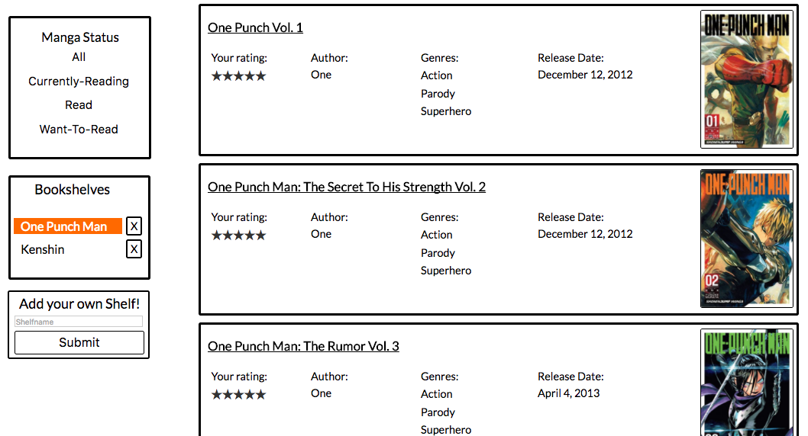

mangaReads
---------------------------------
Project can be accessed at: http://mangareads.herokuapp.com/

mangaReads is a full-stack project based on the website GoodReads.

mangaReads is a organization tool designed to allow users to keep track of what
Japanese comics they are currently reading, check other titles that might be of interest
to them, and see/leave reviews.

Users may select a 'status' for a comic, ranging from 'Read', 'Currently-Reading',
or 'Wants-To-Read'. They may also create their own 'bookshelves', allowing them
to organize their collection in the fashion of their own choosing. Finally, they
can also leave/read reviews of different manga.

This project was created using React, Redux, JavaScript, HTML, Rails, and PostgreSQL.

-----------------------------------

One of the initial goals of this website is to have users to create their
own account, thus allowing them to personalize their comic organization.

Users can create their own account if they wish, but I did leave a guest user
login for those that just wish to see what the site is generally like.

After logging in, the user is sent to the home page. This is a collection of
all comics in the database. Each picture is an  tag that is contained inside
of a anchor tag (<a href=) links to that individual comics page.

The comics are organized in rows using flex-wrap which nice wraps the comics into
rows and moves them to the next line down when reaching the end of the page.

At the top of every page is the Topbar. This appears at the top of every page that
the user goes to, but does not follow them down the page.

After clicking on an individual manga, the user is taken the the manga-show
page.

On the left hand side is the 'Status' dropdown. This allows a user to select from
three categories: 'Read', 'Currently-Reading', and 'Want-To-Read'. This feature
is intended to help users remember comics they are interested in. And the status
can be checked on the my-Manga page, linked to on both the bottom and on
the Topbar.

Next we have the 'user bookshelves'. A key part of this site is allowing a user
to organize their collection in any way that they wish. When a shelf is created,
it will show up here. When clicked, an action is dispatched to the database,
creating/deleting the comic from that particular shelf.

Simple having this work as a toggle saves me from needing to have to
juggle two different actions.

Of some interest is the average rating, as shown by the stars under the
title of the manga. This is not directly found in any table, but is instead
calculated when the comic is displayed. After finding the average reviews,
it is then attached as an extra column.

The Reviews

When the user loads the manga, all reviews are fetched from the db and
displayed under the comic. This will include the user's review if they
have added one themselves. If they haven't, a button will appear asking
for them to submit.

This is easily implemented by simply checking whether or not the user
has a review in the db. In the render method of the component, we can then
see if the user's review is null or not.

A very similar thing is done to show the edit/delete buttons, as we don't
want the user trying to change a review that isn't their own!

React-modal was of great use in helping to create the add/edit/delete abilities.
In particular, when attempting to delete a review or a bookshelf, the user is
given a warning before the action is dispatched.

The Bookshelves

All of the user's statuses and shelves are collected here. This sidebar is
a fixed element, so when the user scrolls down, the sidebar comes along with
them.

Any shelf currently selected is given a 'highlighted' classname and the color
is changed using CSS. Once the user clicks on another shelf, the classname
is switched to 'bg', and the color is changed to white, so as to blend in
with the background.

Manga are organized here, according to the users wishes. A little more info
is given, with the user's review rating (if given), release date, etc. Both
the cover and the title are links to take the user to the individual comic
if they wish to see more.

----------------------

The Future

Several additions that I'm considering:

- allow users to contact one another and see one another's shelves/ updates

- allow filtering by genre/author

- allow voting on reviews so that more helpful reviews will bubble up to
  the top of the reviews

- allowing filtering by star rating which will allow users to see why someone
  did or did not like the comic
